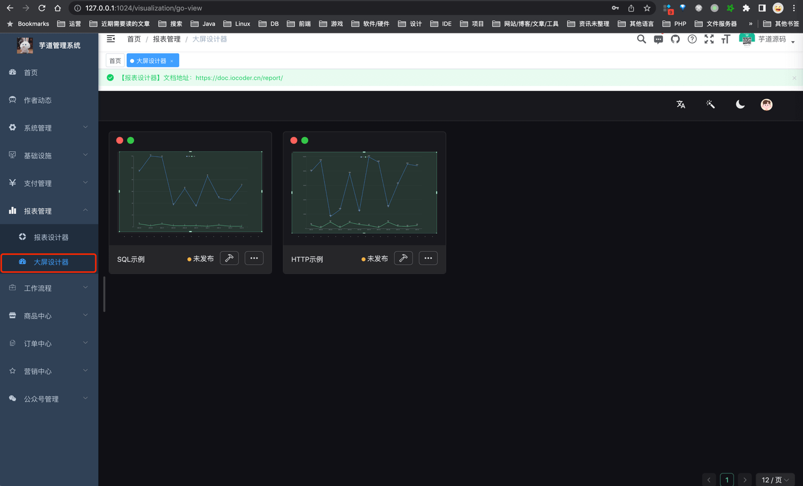
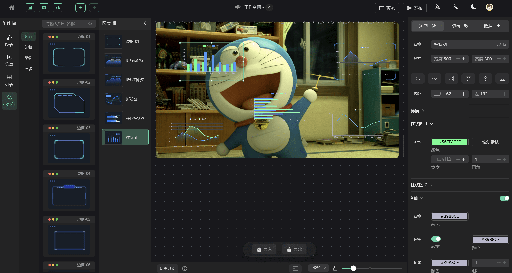
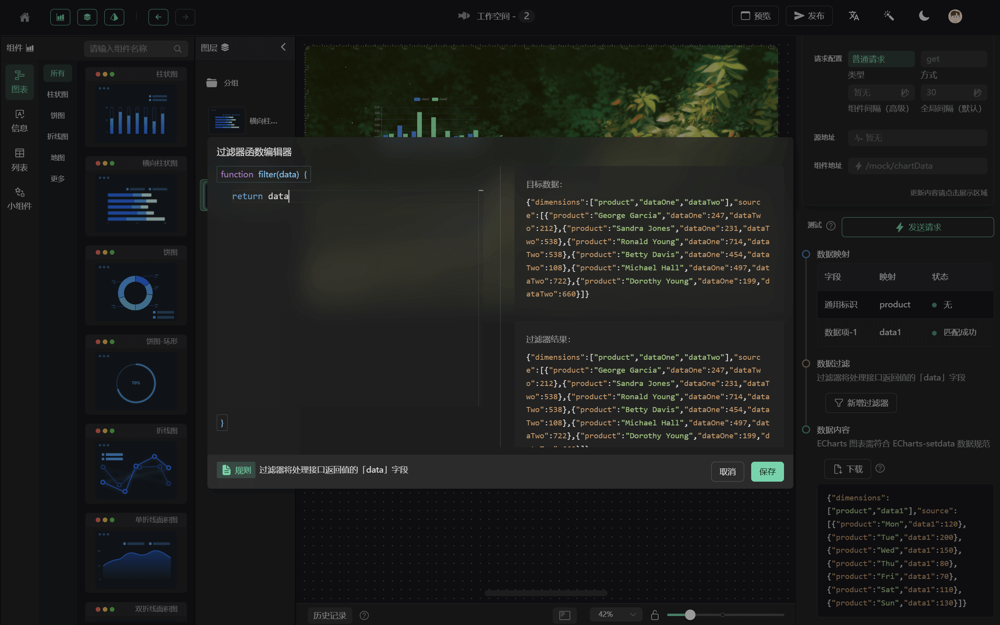
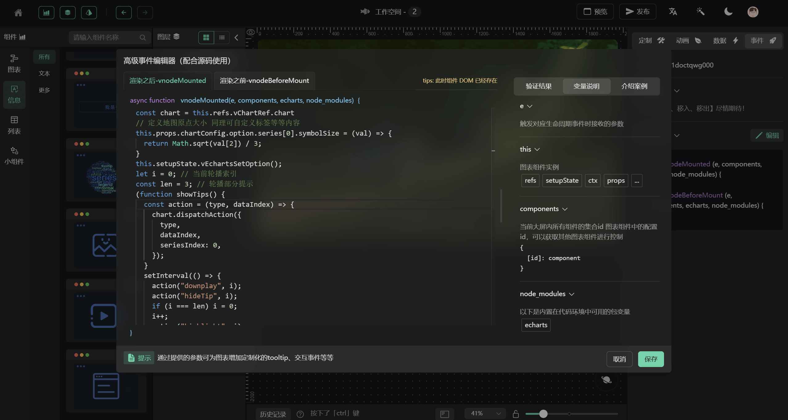
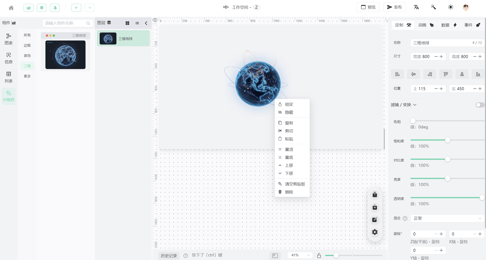

## 总览

    

<h4 align="center">开源、精美、便捷的「数据可视化」低代码开发平台</h4>

由 [芋道](https://doc.iocoder.cn/) 与 GoView 共同建设，基于 Vue3 搭建的低代码数据可视化开发平台，将图表或页面元素封装为基础组件，无需编写代码即可完成业务需求。

* 框架：基于 Vue3 框架编写，使用 hooks 写法抽离部分逻辑，使代码结构更加清晰
* 类型：使用 TypeScript 进行类型约束，减少未知错误发生概率，可以大胆修改逻辑内容
* 性能：多处性能优化，使用页面懒加载、组件动态注册、数据滚动加载等方式，提升页面渲染速度
* 存储：拥有本地记忆，部分配置项采用 storage 存储本地，提升使用体验
* 封装：项目进行了详细的工具类封装如：路由、存储、加/解密、文件处理、主题、NaiveUI 全局方法、组件等
* 入选 NaiveUI 社区精选资源推荐：[查看 NaiveUI 推荐列表](https://www.naiveui.com/zh-CN/light/docs/community)

## 项目地址

* 前端：<https://gitee.com/zhijiantianya/yudao-ui-go-view>
* Boot 后端：<https://gitee.com/zhijiantianya/ruoyi-vue-pro>
* Cloud 后端：<https://gitee.com/zhijiantianya/yudao-cloud>

## 文档地址

* 演示环境：<http://dashboard.yudao.iocoder.cn/login> 「报表管理 - 大屏设计器」
* 文档地址：<https://doc.iocoder.cn/report/>

## 技术栈

主要技术栈为：

| 名称                | 版本    | 名称          | 版本     |
|-------------------|-------|-------------|--------|
| Vue               | 3.2.x | TypeScript4 | 4.6.x  |
| Vite              | 2.9.x | NaiveUI     | 2.27.x |
| ECharts           | 5.3.x | Pinia       | 2.0.x  |
| 详见 `package.json` | 😁    | 🥰          | 🤗     |

开发环境:

| 名称   | 版本      | 名称      | 版本    |
|------|---------|---------|-------|
| node | 16.14.x | npm     | 8.5.x |
| pnpm | 7.1.x   | windows | 11    |

已完成图表：

| 分类  | 名称           | 名称       | 名称      | 名称             |
|-----|--------------|----------|---------|----------------|
| 图表  | 柱状图          | 横向柱状图    | 折线图     | 单/多 折线面积图(渐变色) |
| \*  | 饼图           | 环形图      | 水球图     | 雷达图            |
| \*  | NaiveUI 多种进度 | 散点图      | 对数回归散点图 | 热力图            |
| \*  | 漏斗图          | 中国地图     | 高德地图    | 🦊             |
| 信息  | 文字           | 渐变文字     | 词云      | 嵌套网页           |
| \*  | 图片           | 视频       | 😺      | 🐯             |
| 列表  | 滚动排名列表       | 滚动表格     | 🐮      | 🐐             |
| 小组件 | 边框-01~13     | 装饰-01~05 | 数字翻牌    | 通用时间           |
| \*  | 数字计数         | 倒计时      | 时钟      | 🦁             |

## 项目截图

#### 工作台

#### 请求配置

#### 数据过滤

#### 高级事件编辑

#### 快捷主页

#### 主题色

#### 亮白主题

